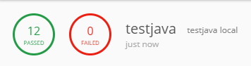
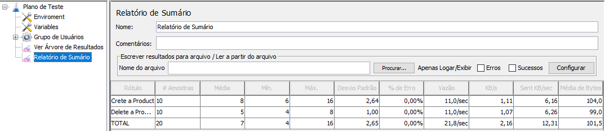

## CRUD - Beleza na Web
Kotlin + Spring Boot + H2 Database Engine + JUnit 5

## Database

**Banco de dados** do projeto: [H2 Database Engine](https://www.h2database.com/html/main.html). 

- Para editar o digrama utilize o DB Designer: https://dbdesigner.page.link/Yf9yQnWhu3HRGxFy7.

_Modelo Entidade Relacional:_

  

### Recursos disponíveis no projeto: 
- _{{domain}}_/h2/console - console do H2 Database Engine

## Postman

**Testes de integração**, localizados na pasta ["integrations/postman"](integrations/postman).

    postman-enviroment_local.json - ambiente local

<b>Clique aqui para ver as evidências:</b>

 
 
 
_Resultado dos testes de integração:_

  

 

_TypeScript utilizado nos testes:_

  

## JMeter

**Testes de performance**, localizados na pasta ["integrations/jmeter"](integrations/jmeter).

<b>Clique aqui para ver as evidências:</b>

 
 
 
_Resultado dos testes de performance:_

  

#### Apêndice

* domain - URL do projeto